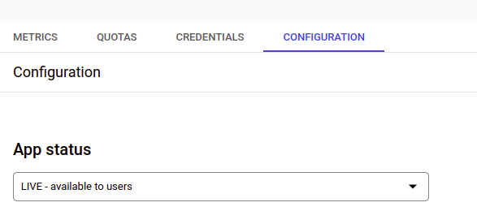
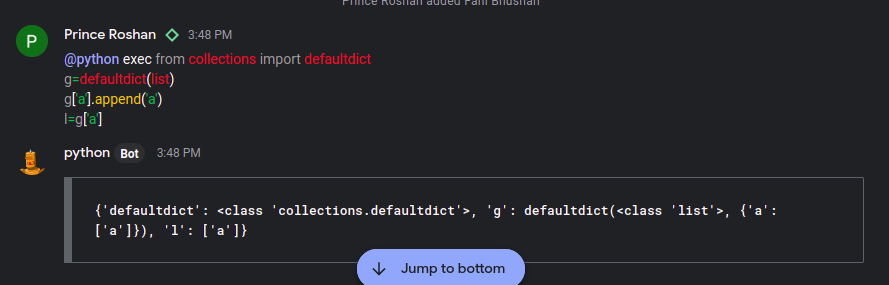

## Python bot

- Example bot which execute python expression and returns a local execution environment which is enough to teach the concept

### General Info

- Instead of inviting someone over call to teach some concept of python you can simply execute the code in google chat itself 

### Requirements

*  Host your app(flask app) somewhere like heroku,netlify.. 
*  Register that endpoint(of flask app) within your gsuite 
    * Register to gsuite [here](https://cloud.google.com/gcp/)
    * Enable the google chat API [here](https://developers.google.com/chat/how-tos/apps-publish#enable_the_google_chat_api)
    * After enabeling google chat API configure your endpoint by clicking on configuration 
     

Do read this tutorial [here](https://www.chatcompose.com/googlechat.html)
This will clearify all your doubts
        
### Using
search for the bot and add it to the space or talk to it directly 
  

### Contributing

Pull requests are welcome. For major changes, please open an issue first to discuss what you would like to change.